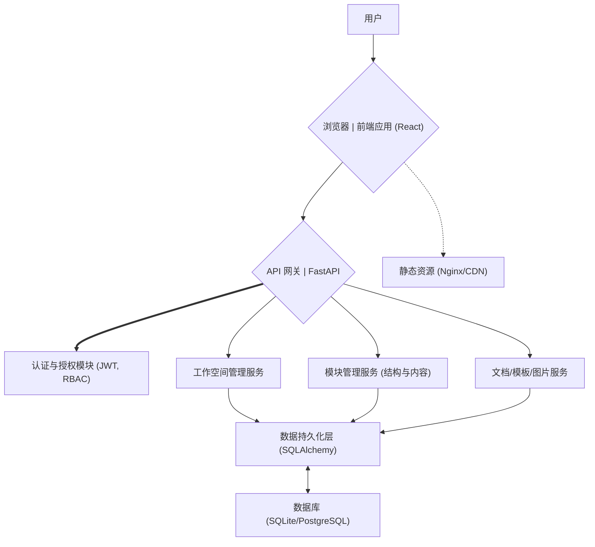

# Archives 知识管理平台

## 1. 项目概述 (Project Overview)

Archives 知识管理平台是一个专为企业内部设计的结构化知识管理与协作平台。它旨在帮助团队高效地创建、组织、共享和可视化复杂的技术文档、项目资料和内部知识库。

本平台的核心价值在于提供标准化的内容构建框架、模块化的信息组织方式、强大的多租户工作空间隔离以及精细化的权限控制，辅以直观的内容可视化工具。项目采用成熟的前后端分离架构，确保了系统的可扩展性、可维护性和高性能。

[](https://deepwiki.com/HZZ177/Archives)

## 2. 功能特性 (Key Features)

### 2.1 多租户工作空间 (Multi-tenant Workspaces)

-   **隔离环境**: 系统支持创建多个独立的工作空间。每个工作空间拥有自己独特的用户集合、文档模块、权限配置和主题设置，实现了数据的逻辑隔离，满足不同团队或项目的独立管理需求。
-   **便捷切换**: 用户可以被授权访问一个或多个工作空间，并通过界面上的选择器轻松切换当前操作的上下文。
-   **上下文感知**: API 请求会自动携带当前工作空间信息 (通过请求参数 `workspace_id` 或请求头 `X-Workspace-ID`)，确保后端操作的正确性与数据隔离。

### 2.2 模块化文档管理 (Modular Document Management)

系统以"模块"作为知识组织的核心单元，提供高度结构化和灵活的文档管理能力。

#### 2.2.1 模块结构 (Module Structure)

-   **层级组织**: 模块可以通过目录节点进行层级化组织，形成类似文件系统的树状结构。内容页面 (或称知识点) 作为叶子节点存在。
-   **结构可视化与导航**: 前端提供交互式的树状视图 (`ModuleStructureTree.tsx`)，方便用户浏览、创建、编辑和管理模块结构。

#### 2.2.2 模块内容 (Module Content)

每个模块内容页 (`ModuleContentPage.tsx`) 被设计为包含多个预定义的专业内容区域，以适应复杂技术文档的需求。主要包括：

-   **功能概述**: 对模块核心功能的简明扼要的介绍 (富文本编辑)。
-   **交互逻辑/流程图**: 集成 [Excalidraw](https://excalidraw.com/) 作为交互式图表编辑器 (`DiagramEditor.tsx`)。支持：
    -   绘制流程图、架构图、示意图等。
    -   图表数据以 JSON 格式 (`diagram_data`) 存储。
    -   支持图表版本控制 (`diagram_version`)。
    -   提供导入/导出 JSON 功能。
    -   自定义编辑器 UI，保留核心操作按钮。
-   **功能详解**: 对模块功能、设计、实现等方面的详细阐述 (富文本编辑)。
-   **涉及的数据库表**: 列出并描述与该模块相关的数据库表结构。
-   **相关的 API 接口**: 列出并描述与该模块相关的后端 API 接口。
-   **关联模块**: 指向其他相关或依赖的模块，构建知识网络。

#### 2.2.3 模块可视化 (Module Visualization)

除了层级树视图外，系统还提供：

-   **模块关系图**: 基于 AntV G6 (`ModuleGraph.tsx`) 实现的力导向图，可视化展示模块之间的关联关系，帮助理解模块间的依赖和交互。

### 2.3 用户与权限管理 (User and Access Control)

系统提供全面且灵活的用户身份验证与授权机制。

-   **身份认证 (Authentication)**:
    -   基于 JWT (JSON Web Tokens) 实现用户会话管理。
    -   用户登录后，后续请求通过 `Authorization: Bearer <token>` 头进行认证。
-   **授权 (Authorization)**:
    -   **基于角色的访问控制 (RBAC)**: 定义了用户 (User)、角色 (Role)、权限 (Permission) 三层模型。
        -   用户可以被分配一个或多个角色。
        -   角色是一系列权限的集合。
        -   权限 (`Permission` 模型) 定义了对特定资源 (如页面、API 端点) 或操作 (如创建、编辑、删除) 的访问许可。
    -   **精细化控制**: 权限可以控制到前端页面的显示/隐藏、路由的访问以及后端 API 的调用。
    -   **层级权限**: `Permission` 模型支持通过 `parent_id`建立层级关系，方便权限的组织和继承。
    -   **超级管理员**: 系统预设超级管理员用户 (`is_superuser=True`)，默认拥有所有权限。该用户在系统初始化时 (`init_db.py`) 创建。

### 2.4 内容编辑 (Content Editing)

-   **富文本编辑器**: 为"功能概述"、"功能详解"等内容区域提供所见即所得 (WYSIWYG) 的富文本编辑器，支持文本格式化、列表、链接、图片插入、代码块等常用功能。
-   **专用编辑器**: 如上述的 Excalidraw 用于图表编辑。

### 2.5 图片管理 (Image Management)

-   **上传与存储**: 支持用户上传图片，后端存储于 `uploads/` 目录下。
-   **内容关联**: 图片可以方便地在富文本编辑器中插入，或与特定文档模块部分关联。

### 2.6 模板管理 (Template Management)

-   **目的**: (此功能在当前代码中的实现程度有待进一步确认，`frontend/src/router.tsx` 中有相关路由占位符) 理论上，模板管理用于创建预设结构的文档模块，帮助用户快速发起符合规范的文档编写。
-   **现状**: DeepWiki 提及数据模型中有 `Template`，但前端具体实现和集成流程需进一步明确。若已实现，则描述其创建、应用流程；若未完全实现，则可标记为未来增强功能或简述其设计目标。

## 3. 技术栈 (Technology Stack)

本平台采用业界主流的前后端分离技术栈构建，确保开发效率、性能与可维护性。

### 3.1 前端 (Frontend)

-   **核心框架**: React 18+ (大量使用 Hooks 和 Context API 进行状态和逻辑管理)
-   **编程语言**: TypeScript (提供强类型支持，提升代码质量和可维护性)
-   **UI 组件库**: Ant Design 5.x (提供丰富、高质量的预设组件，加速开发)
-   **路由管理**: React Router 6 (负责单页应用的页面导航和嵌套路由)
-   **图表可视化**: AntV G6 (用于绘制模块关系图等复杂的图表)
-   **HTTP客户端**: Axios (用于与后端 API 进行异步通信，通过拦截器统一处理请求与响应)
-   **状态管理**: 主要依赖 React Context API (`UserContext`, `WorkspaceContext`) 进行全局状态共享。对于更复杂场景，可按需引入 Zustand 或 Redux Toolkit。

### 3.2 后端 (Backend)

-   **核心框架**: FastAPI (基于 Starlette 和 Pydantic 的现代、高性能 Python Web 框架)
-   **编程语言**: Python 3.9+ (推荐使用较新稳定版本)
-   **异步ORM**: SQLAlchemy 2.0+ (支持异步操作，配合 `asyncpg` (for PostgreSQL) 或 `aiosqlite` (for SQLite))
-   **数据验证**: Pydantic (用于 API 请求/响应数据的校验、序列化以及配置管理)
-   **ASGI 服务器**: Uvicorn (用于运行 FastAPI 应用)

### 3.3 数据库 (Database)

-   **开发环境**: SQLite (轻量级，便于快速启动和开发测试)
-   **生产环境推荐**: PostgreSQL (功能强大，性能稳定，适合生产部署)
-   **数据库迁移**: (当前项目未明确集成 Alembic，若后续引入，需在此说明)

### 3.4 其他工具 (Other Tools)

-   **代码规范与格式化**: Prettier, ESLint (用于统一代码风格，提升代码可读性，建议集成到开发流程中)
-   **版本控制**: Git

## 4. 系统架构 (System Architecture)

### 4.1 总体架构 (Overall Architecture)

本系统采用经典的前后端分离架构模式，通过定义良好的 RESTful API 进行数据交换与功能调用，实现了表现层与业务逻辑层的解耦。



**核心流程说明:**

1.  **用户交互**: 用户通过浏览器访问前端应用。
2.  **前端请求**: 前端应用根据用户操作，向后端 FastAPI 应用发起 API 请求。
3.  **API处理**: FastAPI 接收请求，首先经过认证与授权模块校验用户身份和权限。
4.  **业务逻辑**: 请求被路由到相应的服务模块 (如工作空间管理、模块管理等) 进行业务处理。
5.  **数据操作**: 服务模块通过数据持久化层 (SQLAlchemy Repositories) 与数据库进行交互。
6.  **响应返回**: FastAPI 将处理结果封装后返回给前端，前端更新视图展示给用户。

### 4.2 前端架构 (Frontend Architecture)

前端应用基于 React 技术栈构建，注重组件化、状态管理和工程化。

-   **主要目录结构与职责**:
    -   `src/pages`: 页面级组件，对应各个功能模块的主视图。
    -   `src/components`: 可复用的 UI 组件，分为 `common` (通用基础组件) 和 `business` (业务相关组件)。
    -   `src/layouts`: 应用的整体布局组件，如 `MainLayout.tsx` (包含导航和侧边栏) 和 `AuthLayout.tsx` (登录页布局)。
    -   `src/contexts`: React Context API 实现，用于管理全局共享状态，如 `UserContext.tsx` (用户信息和认证状态) 和 `WorkspaceContext.tsx` (当前选中的工作空间信息)。
    -   `src/apis`: 封装了对后端各模块 API 的调用服务，如 `userService.ts`, `moduleService.ts` 等。
    -   `src/router.tsx`: 应用的路由配置文件 (基于 React Router 6)，实现了页面的懒加载 (Code Splitting) 和私有路由 (`PrivateRoute`) 保护。
    -   `src/utils/request.ts`: 核心的 Axios 实例封装。通过请求和响应拦截器，统一处理 API 请求的认证 Token、自动附加当前工作空间 ID (`workspace_id` 或 `X-Workspace-ID` 头) 以及全局错误提示和处理 (如401自动跳转登录)。
    -   `src/config`: 存放应用的常量和配置信息，如 `constants.ts` (API 基础URL、路由路径等)。
-   **状态管理**: 主要依赖 React Context API 进行全局状态（如用户信息、当前工作空间）的管理。对于页面或组件内部的局部状态，则使用 React Hooks (`useState`, `useEffect` 等)。
-   **API 通信**: 所有与后端的通信均通过 `src/utils/request.ts` 中封装的 Axios 实例进行。这确保了请求行为的一致性，并简化了各业务组件中的 API 调用逻辑。

### 4.3 后端架构 (Backend Architecture)

后端应用基于 FastAPI 构建，充分利用其异步特性和 Pydantic 的数据校验能力，实现高性能和高可靠性的 API 服务。

-   **主要目录结构与职责**:
    -   `app/api`: API 的入口层，包含 `endpoints/` (定义具体的路由和处理函数) 和 `deps.py` (依赖注入，如获取当前用户、数据库会话等)。
    -   `app/services`: 业务逻辑层。封装了核心的业务规则和流程，协调 Repositories 完成复杂操作 (例如，创建一个包含多个关联数据的工作空间)。
    -   `app/repositories`: 数据访问层 (也常称为 DAL 或 CRUD 层)。直接与数据库交互，封装了对 SQLAlchemy 模型的增删改查操作，向上层 Service 提供清晰的数据接口。
    -   `app/models`: SQLAlchemy 数据模型定义，映射数据库表结构。
    -   `app/schemas`: Pydantic 模型定义，用于 API 请求体和响应体的数据验证、序列化和文档自动生成。
    -   `app/core`: 存放应用的核心配置 (`config.py` 从环境变量加载配置)、安全相关工具 (`security.py` 如密码哈希、JWT 生成与解码)、日志配置 (`logger.py`)。
    -   `app/db`: 数据库相关设置，包括数据库会话管理 (`session.py` 提供异步会话)、所有模型的基类 (`base.py`) 以及关键的数据库初始化脚本 (`init_db.py`)。
    -   `main.py`: FastAPI 应用的入口文件，负责创建 FastAPI 实例、配置中间件 (如CORS)、挂载静态文件目录、包含所有 API 路由以及定义应用启动时的事件 (如调用 `init_db`)。
-   **请求处理流程**: 一个典型的 API 请求会经历以下流程：`FastAPI Endpoint (app/api/endpoints/)` -> `Dependency Injection (app/api/deps.py)` -> `Service Layer (app/services/)` (可选，用于复杂逻辑) -> `Repository Layer (app/repositories/)` -> `SQLAlchemy Models (app/models/)` -> `Database`。
-   **数据库初始化 (`app/db/init_db.py`)**: 此脚本在应用首次启动时 (通过 `main.py` 中的 `startup_event`) 自动执行。其核心职责包括：
    1.  根据 `app/models/` 中的定义创建所有数据库表。
    2.  创建系统预设的权限 (`Permission` 模型)。
    3.  创建默认的管理员角色 ("admin") 并赋予其所有系统权限。
    4.  创建默认的超级管理员用户 ("admin"/"admin123") 并分配管理员角色。
    5.  创建 "默认工作区" 并将其分配给管理员用户。
    这个过程确保了系统在首次部署后即可拥有一个可用的基础环境。

## 5. 核心数据模型 (Core Data Models)

系统的核心数据模型围绕用户、工作空间、模块化内容及其权限进行设计，关键模型如下：

-   **`User`**: 代表系统用户。
    -   存储用户的基本信息 (如用户名、密码哈希、邮箱、手机号、是否激活、是否超级管理员)。
    -   通过关联表 `user_role` 与 `Role` 模型建立多对多关系。
    -   通过关联表 `workspace_user` 与 `Workspace` 模型建立多对多关系，记录用户所属工作空间及在该工作空间内的访问级别 (如 `owner`, `editor`, `viewer`)。
    -   可记录用户的默认工作空间 ID (`default_workspace_id`)。

-   **`Role`**: 代表角色，是权限的集合。
    -   包含角色名称、描述、状态等。
    -   通过关联表 `role_permission` 与 `Permission` 模型建立多对多关系。

-   **`Permission`**: 代表具体的操作或页面访问权限。
    -   包含权限代码 (如 `user:create`, `module:edit`)、名称、前端页面路径 (`page_path`)、图标、排序等。
    -   支持通过 `parent_id` 实现层级结构，允许权限的继承和分组。

-   **`Workspace`**: 多租户隔离的基本单元。
    -   包含工作空间名称、描述、图标、主题色、是否默认等。
    -   记录创建者 (`created_by`，关联到 `User` 模型)。
    -   与 `User` 模型通过 `workspace_user` 关联。
    -   一个工作空间可以包含多个 `ModuleStructureNode`。

-   **`ModuleStructureNode`**: 定义知识库中模块的层级结构。
    -   可以是目录节点 (用于组织) 或内容节点 (实际的知识页面)。
    -   包含节点名称、类型 (目录/页面)、所属工作空间 ID (`workspace_id`)、父节点 ID (`parent_id` 以形成树状结构)、排序等。
    -   内容节点类型的 `ModuleStructureNode` 与 `ModuleContent` 存在一对一或一对多(如果内容有版本)的关联。

-   **`ModuleContent`**: 存储具体模块的详细内容。
    -   关联到特定的 `ModuleStructureNode`。
    -   包含多个预定义的内容字段，如：
        -   `overview`: 功能概述 (富文本)。
        -   `diagram_data`: 交互逻辑/流程图的 Excalidraw JSON 数据。
        -   `diagram_version`: 图表数据的版本号。
        -   `detailed_content`: 功能详解 (富文本)。
        -   `db_tables`: 涉及的数据库表 (结构化数据或富文本)。
        -   `api_interfaces`: 相关的 API 接口 (结构化数据或富文本)。
        -   `related_modules`: 关联模块的引用 (结构化数据或富文本)。
    -   记录最后编辑者 (`last_edited_by`，关联到 `User` 模型) 和编辑时间。

-   **`Image`**: 存储上传的图片信息。
    -   包含图片名称、路径、MIME类型、大小等。
    -   可关联到特定模块内容或在富文本中直接引用。

-   **`Template`**: (如果功能完整) 定义文档模块的预设结构或内容模板。
    -   包含模板名称、描述、内容结构等。

这些模型共同构成了 Archives 知识管理平台的数据基础，支持其各项核心功能的实现。

## 6. 本地开发与运行 (Local Development & Running)

### 6.1 环境准备 (Prerequisites)

-   **Node.js**: `18.x` 或更高版本。
-   **Python**: `3.9` 或更高版本 (与后端 FastAPI 版本要求一致)。
-   **包管理工具**: `npm` (随 Node.js 安装) 或 `yarn` (可选)。
-   **Python 包管理**: `pip` (随 Python 安装)。
-   **版本控制**: `Git`。

### 6.2 后端启动 (Backend Setup & Run)

1. **克隆项目仓库**:

2. **创建并激活虚拟环境** (推荐):
    ```bash
    python -m venv venv
    # Windows
    venv\Scripts\activate
    # macOS/Linux
    source venv/bin/activate
    ```

3. **安装依赖**:
    ```bash
    cd backend
    pip install -r requirements.txt
    ```

4. **启动后端开发服务器**:
    ```text
    直接启动main.py
    ```

### 6.3 前端启动 (Frontend Setup & Run)

1. **进入前端目录**:
    ```bash
    cd ../frontend
    ```

2. **安装依赖**:
    ```bash
    npm install
    ```

3. **启动前端开发服务器**:
    ```bash
    npm run dev
    ```
    -   开发服务器通常会运行在 `http://localhost:3000` (具体端口见启动日志)。

## 7. 开发规范 (Development Guidelines)

为保证代码质量、提升协作效率并确保项目的可维护性，所有参与本项目的开发人员应遵循统一的开发规范。

详细的开发规范、代码风格指南、分支策略、提交信息格式等内容，请参考项目根目录下的 `开发规范.md` 文件：

**[阅读开发规范](./开发规范.md)**

## 8. 目录结构 (Directory Structure)

为了清晰地组织项目文件，本项目遵循以下目录结构约定：

```
Archives/
├── .github/                # (可选) GitHub Actions 工作流等
├── .idea/                  # (IDE) IntelliJ/PyCharm 配置 (通常在 .gitignore)
├── .vscode/                # (IDE) VS Code 配置 (通常在 .gitignore)
├── backend/                # 后端 FastAPI 应用
│   ├── app/                # FastAPI 应用核心代码
│   │   ├── api/            # API 接口定义
│   │   │   ├── deps.py     # API 依赖注入 (如获取当前用户、DB会话)
│   │   │   └── endpoints/  # 各模块的 API 路由和处理函数
│   │   ├── core/           # 核心配置、安全工具、日志
│   │   │   ├── config.py   # 应用配置 (环境变量加载)
│   │   │   ├── security.py # 密码哈希、JWT处理
│   │   │   └── logger.py   # 日志配置
│   │   ├── db/             # 数据库相关
│   │   │   ├── base.py     # SQLAlchemy 模型基类 (包含公共字段如id, created_at, updated_at)
│   │   │   ├── init_db.py  # 数据库初始化脚本 (创建表、初始数据)
│   │   │   └── session.py  # 数据库会话管理 (异步)
│   │   ├── models/         # SQLAlchemy 数据模型 (表结构定义)
│   │   ├── schemas/        # Pydantic 数据校验模型 (API请求/响应)
│   │   ├── services/       # 业务逻辑服务层 (处理复杂业务流程)
│   │   ├── repositories/   # 数据访问层 (封装数据库CRUD操作)
│   │   └── main.py         # FastAPI 应用入口 (应用创建、中间件、路由包含、事件)
│   ├── alembic/            # (如果使用) Alembic 数据库迁移脚本
│   │   ├── versions/       # 迁移版本文件
│   │   └── env.py          # Alembic 配置
│   ├── static/             # (较少使用) 后端提供的静态文件 (前端通常独立处理)
│   ├── uploads/            # 用户上传文件存储目录 (如图片、图表JSON数据)
│   ├── tests/              # 后端测试代码 (Pytest)
│   ├── .env.example        # 环境变量示例文件
│   ├── Dockerfile          # (可选) 后端 Docker 镜像构建文件
│   └── requirements.txt    # Python 依赖列表
├── frontend/               # 前端 React 应用
│   ├── public/             # 静态资源 (index.html, favicons, manifest.json 等)
│   ├── src/                # 前端源代码
│   │   ├── apis/           # API 服务封装 (调用后端接口，如 userService.ts)
│   │   ├── assets/         # 本地静态资源 (如图片、字体、全局SVG图标)
│   │   ├── components/     # React 组件
│   │   │   ├── common/     # 通用基础组件 (如按钮、输入框的自定义封装)
│   │   │   └── business/   # 业务相关通用组件 (如用户选择器、模块树)
│   │   ├── config/         # 应用配置 (如常量、路由定义、主题配置)
│   │   ├── contexts/       # React Context (全局状态管理，如 AuthContext, WorkspaceContext)
│   │   ├── hooks/          # 自定义 React Hooks (如 useDebounce, useAuth)
│   │   ├── layouts/        # 页面布局组件 (如 MainLayout, AuthLayout)
│   │   ├── pages/          # 页面级组件 (对应各路由)
│   │   ├── router/         # 路由配置 (router.tsx, privateRoute.tsx)
│   │   ├── styles/         # 全局样式、主题变量、通用SASS/LESS混合宏
│   │   ├── types/          # TypeScript 类型定义 (全局类型、接口定义)
│   │   ├── utils/          # 工具函数 (如 request.ts, validators.ts, formatters.ts)
│   │   ├── App.tsx         # 应用根组件
│   │   └── main.tsx        # 应用入口文件 (渲染 App 组件)
│   ├── .env.development    # 开发环境变量
│   ├── .env.production     # 生产环境变量
│   ├── .eslintignore       # ESLint 忽略配置
│   ├── .eslintrc.js        # ESLint 配置文件
│   ├── .prettierrc.js      # Prettier 配置文件
│   ├── Dockerfile          # (可选) 前端 Docker 镜像构建文件 (通常用于Nginx部署)
│   ├── package.json        # 项目元数据和NPM依赖
│   └── tsconfig.json       # TypeScript 编译器配置
├── .gitignore              # Git 忽略文件配置
├── 开发规范.md             # 项目开发规范文档
├── README.md               # 项目说明文档 (本文档)
└── LICENSE                 # (可选) 项目许可证文件
```

## 9. 未来扩展方向 (Future Enhancements)

Archives 知识管理平台为未来的功能增强和演进奠定了坚实的基础。以下是一些可能的扩展方向：

-   **RAG (Retrieval Augmented Generation) 集成**: 利用平台内结构化的知识数据，作为大型语言模型 (LLM) 的高质量知识源，构建智能问答、内容生成等高级 AI 应用。
-   **导入导出功能**: 支持将模块内容或整个工作空间导出为标准格式 (如 Markdown, PDF, JSON)，或从这些格式导入。
-   **内容版本控制与回溯**: 对模块内容实现更细致的版本历史记录和比较功能，允许用户回溯到之前的版本。
-   **自定义模块内容类型**: 允许管理员或高级用户定义新的模块内容区域类型，以适应更多样化的知识表达需求。
-   **丰富的可视化工具**: 集成更多数据可视化图表类型，例如思维导图、甘特图等，增强知识的呈现形式。
-   **实时协作编辑**: 支持多个用户同时编辑同一模块内容，并能看到对方的实时修改。
-   **外部系统集成**: 提供 API 或 Webhooks，方便与企业内部其他系统 (如项目管理、代码仓库、OA系统) 进行数据同步或功能联动。
-   **审计日志与分析**: 记录更详细的用户操作日志，并提供数据分析仪表盘，帮助管理员了解平台使用情况和内容热度。
-   **国际化与本地化**: 支持多语言界面和内容。
-   **通知系统**: 对关键操作（如内容更新、权限变更、评论提及）提供应用内或邮件通知。
